```{r setup, include=FALSE}
knitr::opts_chunk$set(echo = FALSE)
```

### Copyright

All the material presented here, to the extent it is original, is available under [CC-BY-SA](https://creativecommons.org/licenses/by-sa/4.0/). 

### Source and links

The  presentation file is on github at: (https://rsbivand.github.io/geostat19_talk)

### Required current contributed CRAN packages:

I am running R 3.6.1, with recent `update.packages()`.

```{r, echo=TRUE}
needed <- c("sf", "mapview", "sp", "rgdal", "wordcloud", "RColorBrewer", "rgeos", "magrittr", "igraph", "miniCRAN", "ctv", "RSQLite", "lwgeom")
```


### Script

Script at https://github.com/rsbivand/geostat19_talk/raw/master/geostat_bivand_19.zip. Download to suitable location and use as basis.

### Introduction

- Understanding the original uses of S and R (in the 1980s and 1990s), and seeing how these uses affected the development of R lets us appreciate the robustness of R's ecosystem. 

- This talk uses readings of the R sources and other information to explore R's history. The topics to be touched on include the "colour" books (brown, blue, white, green), interlinkages to SICP (Scheme) and LispStat

- This should show where and when impulses flowed between R and the development of capabilities in R for spatial data analysis

- The focus will be on the period 1997-2004, which is when a lot of the foundations for R spatial came into being

## History of R and its data structures

### Sources

- [Rasmus Bååth](http://www.sumsar.net/blog/2014/11/tidbits-from-books-that-defined-s-and-r/) has a useful blog piece on R's antecedents in the S language

- Something similar is present in the second chapter of Chambers [-@chambers:16], from the viewpoint of one of those responsible for the development of the S language

- In addition to S, we need to take [SICP and Scheme](http://sarabander.github.io/sicp/html/index.xhtml) into account [@sicp2e], as described by Ihaka and Gentleman [-@ihaka:1996] and Wickham [-@wickham:14]

- Finally, LispStat and its creators have played and continue to play a major role in developing R [@Tierney1990; @Tierney1996; @JSSv013i09]

### Early R was Scheme via SICP


([JSM talk](https://www.stat.auckland.ac.nz/%7Eihaka/downloads/JSM-2010.pdf))


### From S to R: Brown Books


Becker and Chambers [-@becker+chambers:84]: S: An Interactive Environment for Data Analysis and Graphics, A.K.A. the Brown Book

Becker and Chambers [-@becker+chambers:85]: Extending the S System


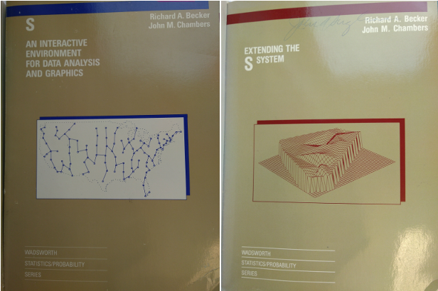


### From S to R: Blue and White Books


Becker, Chambers and Wilks [-@R:Becker+Chambers+Wilks:1988]: The New S Language: A Programming Environment for Data Analysis and Graphics, A.K.A. the Blue Book.

Chambers and Hastie [-@R:Chambers+Hastie:1992]: Statistical Models in S, A.K.A. the White Book.


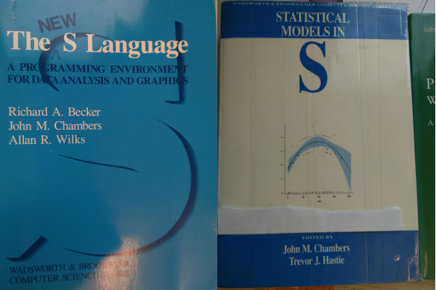


### From S to R: Green Book


Chambers [-@R:Chambers:1998]: Programming with Data: A Guide to the S Language, A.K.A. the Green Book.

Venables and Ripley [-@R:Venables+Ripley:2000]: S Programming

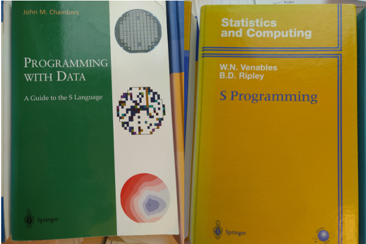


### S2 to S3 to S4

- The S2 system was described in the Brown Book, S3 in the Blue Book and completed in the White Book, finally S4 in the Green Book

- The big advance from S2 to S3 was that users could write functions; that data.frame objects were defined; that formula objects were defined; and that S3 classes and method dispatch appeared

- S4 brought connections and formal S4 classes, the latter seen in R in the **methods** package ([still controversial](https://stat.ethz.ch/pipermail/r-devel/2017-December/075304.html))

- [S-PLUS](https://en.wikipedia.org/wiki/S-PLUS) was/is the commercial implementation of [S](https://en.wikipedia.org/wiki/S_(programming_language)) and its releases drove S3 and S4 changes

### S, Bell Labs, S-PLUS

- S was a Bell Labs innovation, like Unix, C, C++, and many interpreted languages (like AWK); many of these share key understandings

- Now owned by Nokia, previously Alcatel-Lucent, Lucent, and AT&T

- Why would a telecoms major (AT&T) pay for fundamental research in computer science and data analysis (not to sell or market other products better)?

- Some Green Book examples are for quality control of telecoms components

### S-PLUS and R

- S-PLUS was quickly adopted for teaching and research, and with S3, provided extensibility in the form of libraries

- Most links have died by now, but see this [FAQ}](http://ftp.uni-bayreuth.de/math/statlib/S/FAQ) for a flavour - there was a lively community of applied statisticians during the 1990s

- S built on a long tradition of documentation through examples, with use cases and data sets taken from the applied statistical literature; this let users compare output with methods descriptions

- ... so we get to R


### and what about LispStat?

- Luke Tierney was in R core in 1997, and has continued to exert clear influence over development

- Because R uses a Scheme engine, similar to Lisp, under the hood, his insight into issues like the garbage collector, namespaces, byte-compilation, serialization, parallelization, and now [ALTREP](http://blog.revolutionanalytics.com/2018/04/r-350.html) has been crucial ([see also the proposal by Luke Tierney, Gabe Becker and Tomas Kalibera}](https://svn.r-project.org/R/branches/ALTREP/ALTREP.html))

- Many of these issues involve the defensive copy on possible change policy involved in lazy evaluation, which may lead to multiple redundant copies of data being present in memory

- Luke Tierney and Brian Ripley have fought hard to let R load fast, something that is crucial to ease the use of R on multicore systems or inside databases

## R spatial and R-sig-geo

### Antecedents (among others)

- The [AI-GEOSTATS](https://wiki.52north.org/AI_GEOSTATS/ForumHistory) listserve/mailing list was started by Gregoire Dubois in 1995; AI was from Arc/Info

- GRASS accepted code contributions, then kept in `src.contrib` and `src.garden` and GRASS mailing lists were active (the archives seem to have been lost in moving from minordomo to mailman in 2001)

- Bao et al. [-@Baoetal00] describe S-PLUS links to GRASS and ArcView; the module for spatial statistics was also from the mid-1990's

- `MASS` included S and compiled code for kriging, trend surfaces and point pattern analysis, `splancs` provided point pattern analysis

### Albrecht Gebhardt

- Much of the porting of S code to R for spatial statistics was begun by Albrecht Gebhardt

- The CRAN archives show `tripack` and `akima` - both with ACM licenses - from August 1998; `ash` and `sgeostat` followed in April 1999

- The date for the MASS `spatial` package is unknown because it was bundled in the `VR` metapackage subsequently split into `spatial`, `MASS`, `nnet` and `class`

- In the earliest period, CRAN admins helped practically with porting

### Barry Rowlingson

- Rowlingson and Diggle [-@rowlingson+diggle:93] describes the S-PLUS version of `splancs` for point pattern analysis

- I'd contacted Barry in 1997 but only moved forward with porting `splancs` as R's ability to load shared objects advanced

- In September 1998, I wrote to him:

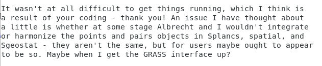

- The earliest `splancs` in the CRAN archive is from November 2000

### 1998 ERSA talk

- Albrecht and I were teaching spatial data analysis using R and code that would go into CRAN packages (I still have the package I wrote, and the exams)

- In 1998, the ERSA (European Regional Science Association) meeting was in Vienna, and we gave a talk subsequently published in Bivand and Gebhardt [-@Bivand2000]

- We covered R, point pattern analysis, geostatistics, ESDA and spatial econometrics

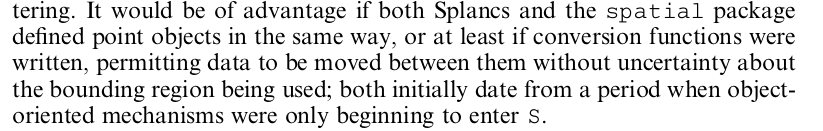

### GEOCOMP 2000

- Markus Neteler and I were in touch too, as I'd been trying to interface R and GRASS [@BIVAND20001043]

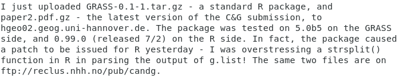

- The first `GRASS` package in the CRAN archive is from November 2000

- Before that, we'd presented at GeoComputation 2000 in Chatham Bivand and Neteler [-@geocomp00]

### Nicholas Lewin-Koh

- Nicholas Lewin-Koh posted on the R list (subsequently split between R-help and R-devel) in September 2000, asking about coding the reading of ESRI shapefiles

- He made a number of key contributions which ended up in `spweights` - currently part of `spdep` - and what became `maptools`

- He wrote the first vector representation based on the shapefile import format, and I should be blamed for subsequent fumbling implementations in `maptools`

### DSC 2001

- From interaction with Kurt Hornik, Ross Ihaka and Brian Ripley on the R list during late 2000, contacts widened, including Tim Keitt (`rgdal`)

- I ended up presenting at the DSC meeting in Vienna in March 2001, getting to meet many R core members, developers and CRAN admins

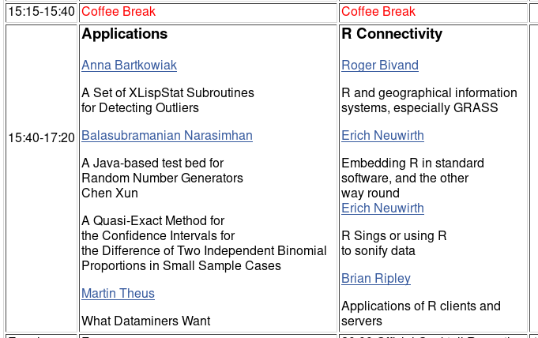

### Luc Anselin

- Further contacts came from a CSISS workshop organised by Luc Anselin in May 2002 in Santa Barbara, including Konstantin Krivoruchko (ESRI) and Gilberto Câmara (INPE)

- My talk eventually appeared as Bivand [-@doi:10.1111/j.0016-7363.2005.00672.x], but the contacts were more useful

- Visiting the INPE earth observation lab and presenting at a conference in December 2002 provided further ideas and links to TerraLib

- Luc himself contributed code to `spdep` and continues be very supportive

- I did a further piece for the ERSA 2002 conference in Dortmund [@Bivand2002]

### Getting to R spatial

- The DSC meeting in March 2003 was also being planned for Vienna, and I'd talked about it with Kurt Hornik when he gave a keynote at the GRASS meeting in Trento in September 2002

- I met Virgilio Gómez-Rubio at the GRASS meeting among many others and talked about `DCluster` and `RArcInfo`

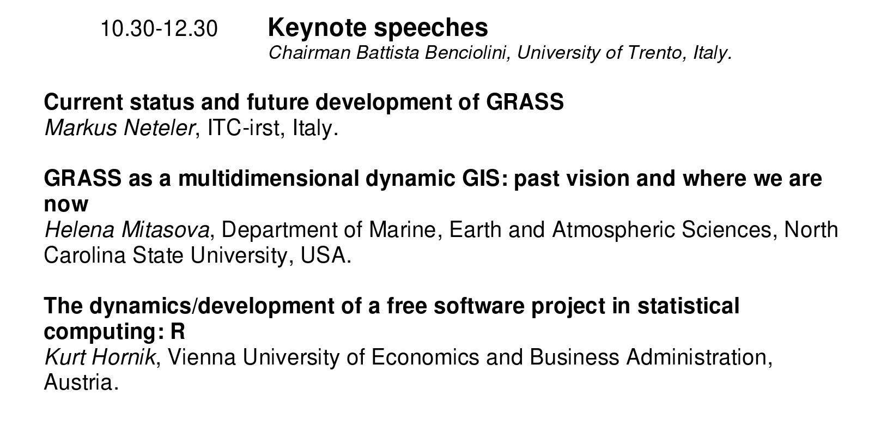{width=80%}

### Planning for R spatial

- In mid November I started emailing contacts to invite sumbissions for a spatial statistics session at DSC, and a workshop at which we could discuss working together

- Of the replies, far more would have liked to attend than were able to [@pebesma:04; @DCluster:2005; @gomez-rubioCG:05]

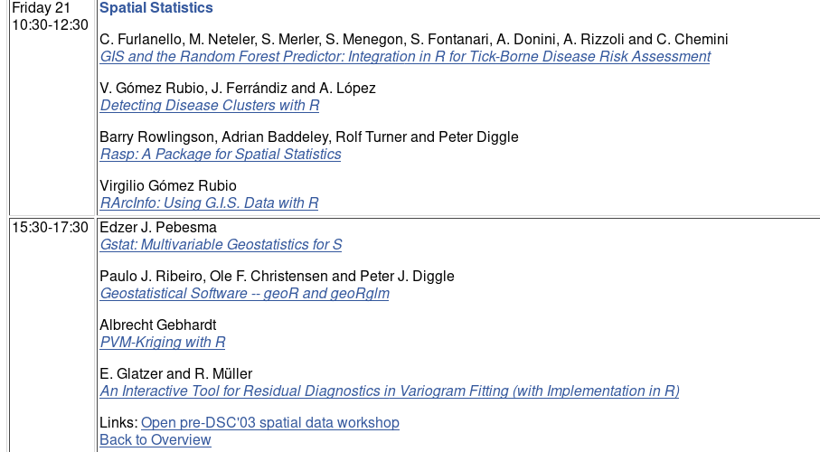

### Workshop

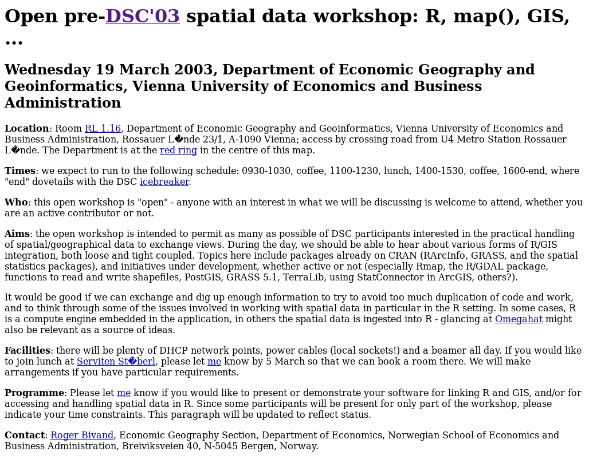{width=80%}

### Edzer Pebesma

- Edzer was already well known because of his open-source `gstat` program [@pebesma98]

- From Edzer's reply 13 November 2002

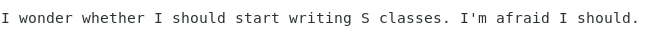

### Edzer Pebesma

Correspondence developed quickly (21 November)

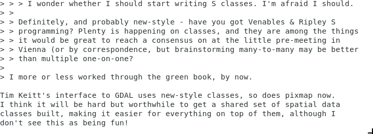


### Classes and Nicholas Lewin-Koh

Contribution even though he couldn't get to Vienna:

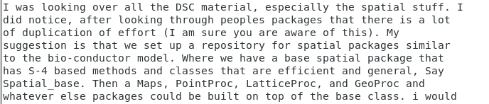

### E-mail traffic: PROJ4

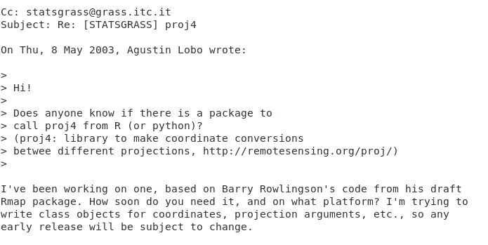

### R-sig-geo

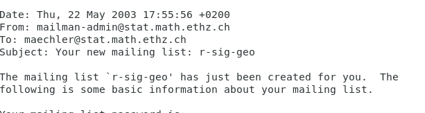

### StatGIS meeting 2003

- Albrecht Gebhardt was a local organiser for a meeting at which many of those at the DSC workshop met in October 2003


### useR! 2004

- R News class description: [@pebesma+bivand:05]

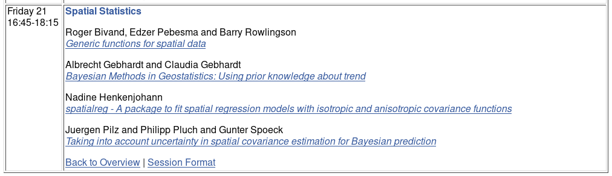


### CRAN arrivals

- `fields` and `geoR` in mid-2001, `spatstat` in early 2002

- `gstat` in February 2003, `maptools` in August 2003, `rgdal` in November 2003

- `sp` in April 2005 (after a workshop in Lancaster November 2004 and before one in Valencia May 2005)

- `classInt` in March 2006, `spgrass6` in August 2006

### useR! 2006

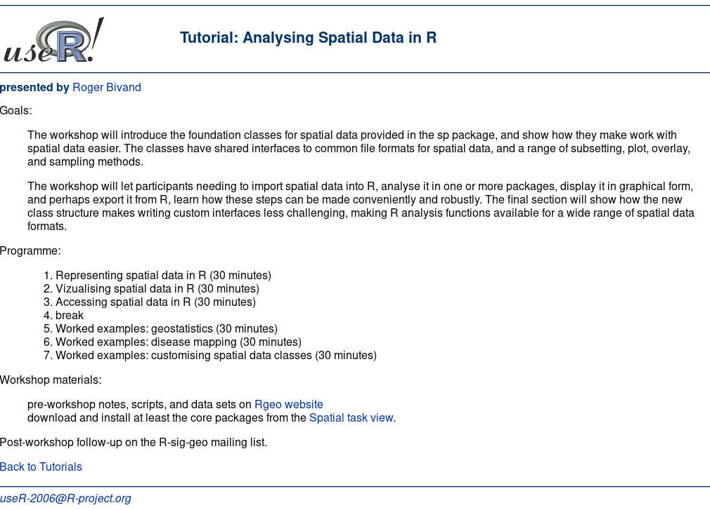

### useR! 2006

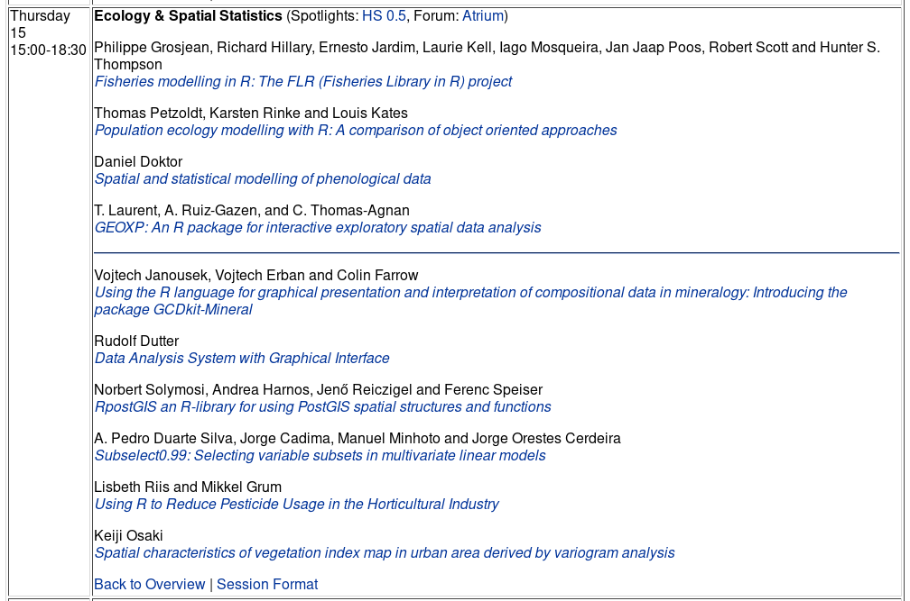

## Open Source Geospatial software stacks


### Software component stacks

- A chapter written in 2011 and published three years later has an overview [@bivand14]

- Before discussing software component stacks for GC, we should acknowledge the importance of open standards for geospatial data interchange

- Kralidis [-@kralidis08] points out the importance of concepts such as that of spatial data infrastructure, whether established within national jurisdictions, within supranational jurisdictions, or by international standards organisations

- A fuller coverage of the relationships between spatial data infrastructures and free and open source geospatial software is given by Steiniger and Hunter [-@steiniger+hunter12]

- Kralidis also helpfully distinguishes between formal, de facto,
and ad hoc standards, which provide the flexibility needed to move ahead
somewhat faster than standards committees are usually able to do

### Component stacks

- Software components appear to have been defined first by
McIlroy [-@mcilroy69], as interchangeable subassemblies by analogy with
mass production manufacturing

- The software component stack has been a core concept of programming at
least since the publication of Kernighan and Plauger[-@kernighan+plauger76], systematising
the experience of Bell Labs computer scientists

- Some of the lessons are made clear in programming itself
[@kernighan+pike99], while others affect how one may "glue"
small utility functions together in an interactive and/or scripting
language [@kernighan+pike84]

- Consequently, a software component stack can be taken as sequence
of component programs that are used together to achieve a common
goal

- Using stacks of components becomes attractive when task objectives
can more easily be met by using components developed by others than by
developing them independently

- When the costs of keeping a stack working
exceed those of rewriting, the stack may fail, but this is seldom the
case

- Open source software developers often advertise application
programming interfaces (API), with an implicit promise that
other downstream developers using the API will be less subject to
incompatible changes

- It is then vital that changes in these
underlying components do not change the way that dependent components
function, unless their earlier behaviour had been in error

### Dependency challenges

- As already noted, developers wishing to integrate software components in
stacks must pay careful attention to the versioning of the components,
and to the impacts of upstream changes on downstream components

- The terms upstream and downstream refer to the ordering of the components,
with data flowing from upstream to downstream components

- If the specification of an upstream component changes, those following it will
need to be modified

- If the changes are forced by real bugs being fixed,
or security holes being blocked, downstream components must react in
appropriate ways

- However, some changes occur for other reasons, such
as code cleaning, reimplementation, or the resolution of licence issues
in otherwise functioning code

- In most cases, upstream developers then
attempt to reduce changes in their interfaces with downstream components
to an unavoidable minimum

- Open source projects are typically most constrained with respect to
developer time for maintenance, including the revision of functioning
code to accommodate upstream changes that may not improve downstream
performance

- A particularly troublesome issue for dynamically linked software
components in relatively long-running applications is that of thread
safety

### Open source geospatial projects

- The Open Source Geospatial Foundation was brought into being in 2006
as a successor to the Mapserver Foundation, itself created the year
before

- In addition to providing a shared infrastructure and procedural framework
for web mapping, desktop application and geospatial library projects,
OSGeo aims to promote open source geospatial software use and development,
including use integrated with proprietary software

- McIhagga [-@mcihagga08] discusses some of the ways in which communities
of practice have developed, with particular reference to web
mapping, and in his description, the open source web mapping
"ecology"

- The Geospatial Data Abstraction Library is a crucial part
of the upstream geospatial library infrastructure

- One of the most important components required by geospatial applications
is the provision of robust and clear representations of coordinate
reference systems

- Because GEOS uses OGC SFS specifications for geometries, it does not "build" topologies in the classical GIS arc-node understanding

- GRASS (Geographic
Resources Analysis Support System) was already twenty years old
when the GRASS developers collaborated in founding OSGeo, and they
have been playing an important role in the broader OSGeo movement
[@neteleretal08]; many of the more recent developments in 
GRASS are covered by Neteler et al. [-@neteleretal12]

## Ongoing changes in external sofware (GEOS, GDAL, PROJ)


```{r echo=FALSE}
knitr::include_graphics('pix/sf_deps.png')
```


### PROJ

Because so much open source (and other) software uses the PROJ library and framework, many are affected when PROJ upgrades. Until very recently, PROJ has been seen as very reliable, and the changes taking place now are intended to confirm and reinforce this reliability. Before PROJ 5 (PROJ 6 is out now, PROJ 7 is coming early in 2020), the `+datum=` tag was used, perhaps with `+towgs84=` with three or seven coefficients, and possibly `+nadgrids=` where datum transformation grids were available. However, transformations from one projection to another first inversed to longitude-latitude in WGS84, then projected on to the target projection.


### Big bump coming:

'Fast-forward 35 years and PROJ.4 is everywhere: It provides coordinate handling for almost every geospatial program, open or closed source. Today,  we  see  a  drastical  increase  in  the  need  for  high  accuracy  GNSS  coordinate  handling, especially in the agricultural and construction engineering sectors.  This need for geodetic-accuracy transformations  is  not  satisfied  by  "classic  PROJ.4".  But  with  the  ubiquity  of  PROJ.4,  we  can provide these transformations "everywhere", just by implementing them as part of PROJ.4' [@evers+knudsen17].


### Escaping the WGS84 hub/pivot: PROJ and OGC WKT2


Following the introduction of geodetic modules and pipelines in PROJ 5 [@knudsen+evers17; @evers+knudsen17], PROJ 6 moves further. Changes in the legacy PROJ representation and WGS84 transformation hub have been coordinated through the [GDAL barn raising](https://gdalbarn.com/) initiative. Crucially WGS84 often ceases to be the pivot for moving between datums. A new OGC WKT is coming, and an SQLite EPSG file database has replaced CSV files. SRS will begin to support 3D by default, adding time too as SRS change. See also [PROJ migration notes](https://proj.org/development/migration.html).

There are very useful postings on the PROJ mailing list from Martin Desruisseaux, first [proposing clarifications](https://lists.osgeo.org/pipermail/proj/2019-July/008748.html) and a [follow-up](https://lists.osgeo.org/pipermail/proj/2019-August/008750.html) including a summary:

> * "Early binding" ≈ hub transformation technique.

> * "Late binding" ≈ hub transformation technique NOT used, replaced by
a more complex technique consisting in searching parameters in the
EPSG database after the transformation context (source, target,
epoch, area of interest) is known.

> * The problem of hub transformation technique is independent of WGS84.
It is caused by the fact that transformations to/from the hub are
approximate. Any other hub we could invent in replacement of WGS84
will have the same problem, unless we can invent a hub for which
transformations are exact (I think that if such hub existed, we
would have already heard about it).

> The solution proposed by ISO 19111 (in my understanding) is:

> * Forget about hub (WGS84 or other), unless the simplicity of
early-binding is considered more important than accuracy.

> * Associating a CRS to a coordinate set (geometry or raster) is no
longer sufficient. A {CRS, epoch} tuple must be associated. ISO
19111 calls this tuple "Coordinate metadata". From a programmatic
API point of view, this means that getCoordinateReferenceSystem()
method in Geometry objects (for instance) needs to be replaced by a
getCoordinateMetadata() method.


In QGIS built on current PROJ 6 with the `proj.h` API (and GDAL built on current PROJ 6 with the `proj.h` API), we see the following sequence of GUI windows when trying to open the olinda.gpkg file.


```{r echo=FALSE}
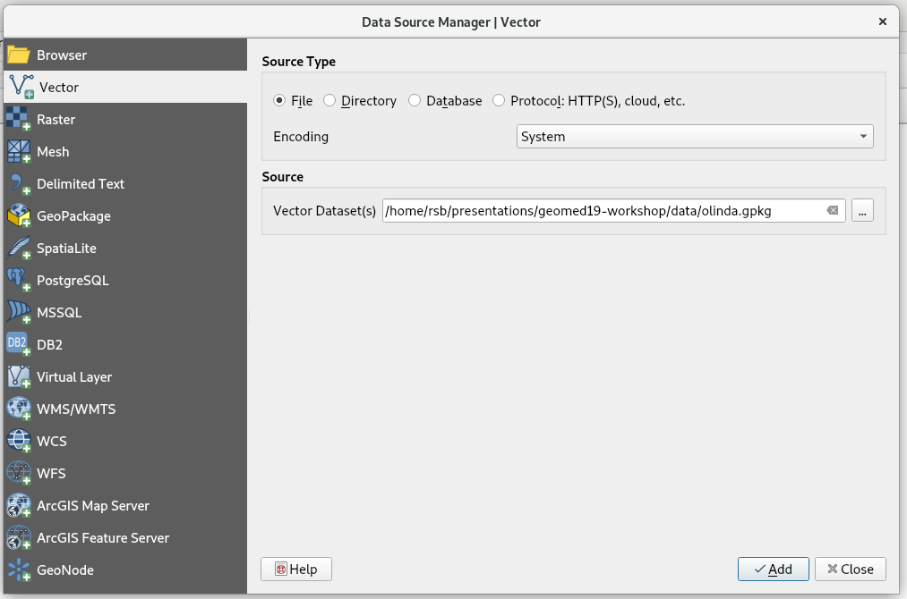
```

Instead of using the declared coordinate reference system of the added layer to provide a transformation/conversion relationship to possible WGS84 geographical coordinate or web mapping backgrounds, the user of the most recent QGIS version with PROJ 6 faces a choice of three alternatives with varying availabilities and precisions:

```{r echo=FALSE}
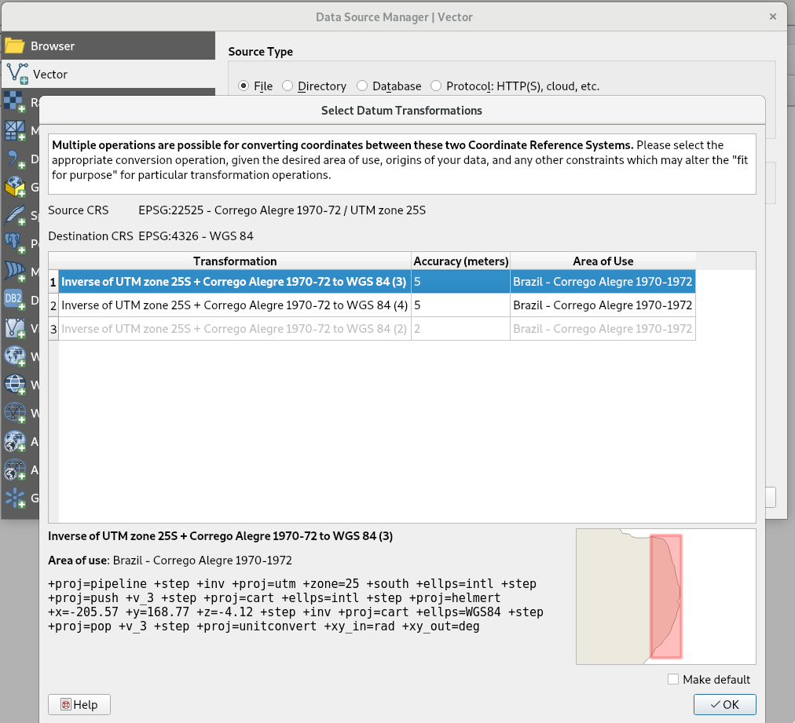
```

```{r echo=FALSE}
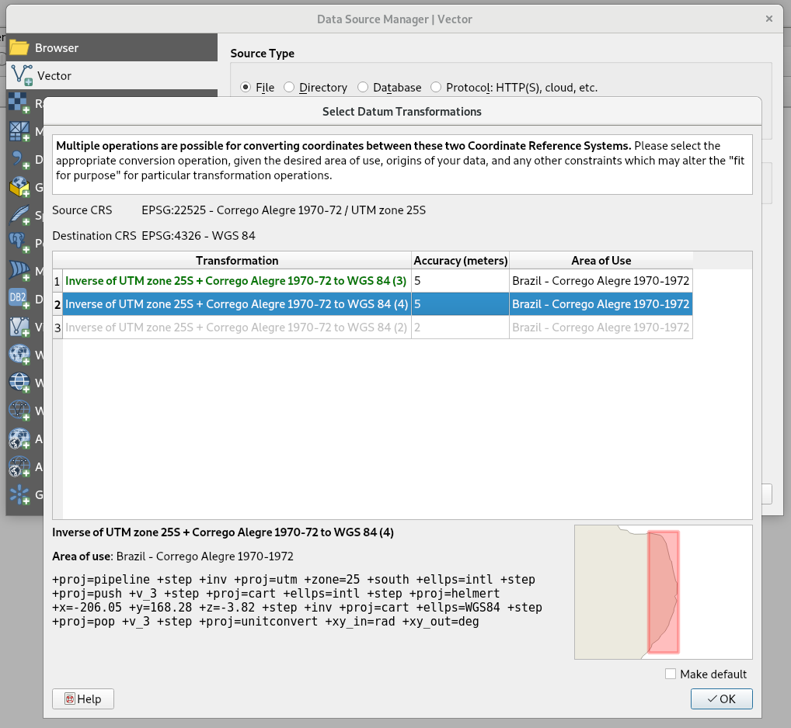
```

The third alternative has better precision, but depends on finding and installing an NTv2 grid file in the PROJ `shared/proj` metadata folder:

```{r echo=FALSE}
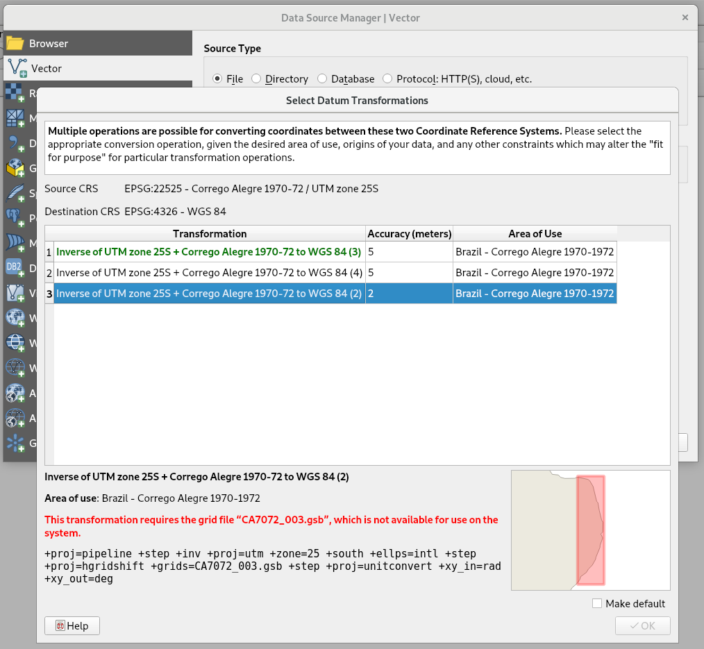
```

If we install the file, the choices change to promote the more precise NTv2-based path to the first position:

```{r echo=FALSE}
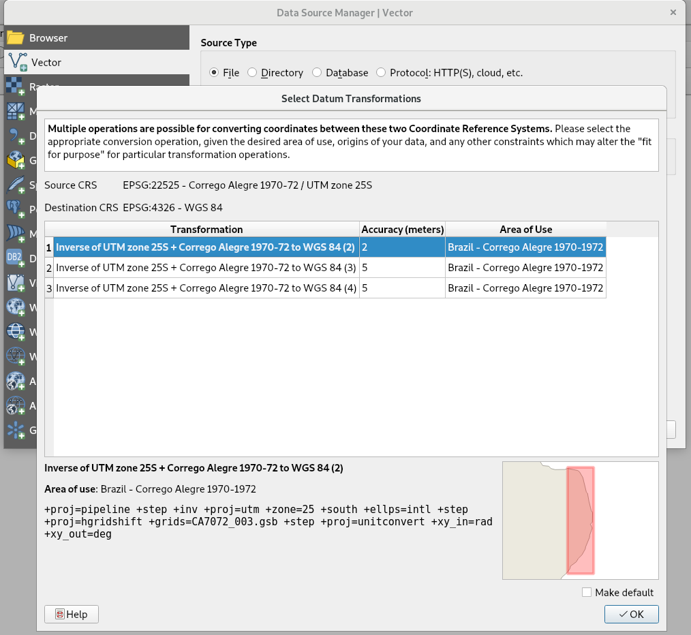
```

```{r, echo=TRUE}
library(sf)
packageVersion("sf")
```

The final element reported by `sf::sf_extSoftVersion()` shows whether **sf** was built with the `proj.h` interface to PROJ, or the legacy `proj.api.h` interface. However, GDAL also has to be built with the `proj.h` interface for everything to line up:

```{r, echo=TRUE}
sf_extSoftVersion()
```


```{r, echo=TRUE}
st_crs(22525)
```

The OGC WTK2 definition now contains a usage/scope term showing where the definition may be used; there may also be a temporal frame for a definition.

```{r, echo=TRUE}
cat(system("projinfo EPSG:22525", intern=TRUE), sep="\n")
```

If we ask about possible transformations/conversions, we see choices we saw among those represented in QGIS (I work on two apparently identical systems, which may give different choice counts)

```{r, echo=TRUE}
cat(system("projinfo -s EPSG:22525 -t EPSG:31985", intern=TRUE), sep="\n")
```

The input data use the Corrego Alegre 1970-1972 setting, and still provide a `+towgs84=` key representation for pivoting through WGS84:

```{r, echo=TRUE}
olinda <- st_read("data/olinda.gpkg", quiet=TRUE)
st_crs(olinda)
```

We'll just use one point to check things out:

```{r, echo=TRUE}
xy_c <- st_centroid(st_geometry(olinda[  1,]))
st_coordinates(xy_c)
```

If we manually pivot through WGS84 on the way back to SIRGAS2000 UTM, we get:

```{r, echo=TRUE}
st_coordinates(st_transform(st_transform(xy_c, 4326), 31985))
```

Without the NTv2 grid file `CA7072_003.gsb` we seem to get the same:

```{r, echo=TRUE}
# without CA7072_003.gsb
st_coordinates(st_transform(xy_c, 31985))
```

but we also get the same with the grid file if we leave the `+towgs84=` key in the PROJ string:

```{r, echo=TRUE, eval=FALSE}
# with CA7072_003.gsb
st_coordinates(st_transform(xy_c, 31985))
#          X       Y
# 1 295489.3 9120352
```

If however we manipulate the PROJ string to specify the grid file instead of the `+towgs84=` key, we can get the improved precision:

```{r, echo=TRUE, eval=FALSE}
# with CA7072_003.gsb
xy_c1 <- xy_c
st_crs(xy_c1) <- "+proj=utm +zone=25 +south +ellps=intl +units=m +nadgrids=CA7072_003.gsb"
print(st_coordinates(st_transform(xy_c1, 31985)), digits=9)
#            X          Y
# 1 295486.396 9120350.62
```

Let's try to use the PROJ utility program `cs2cs` in its PROJ 6 version. The `cs2cs` version when the grid file is present matches `sf::st_transform()` when the input CRS is modified to point to the grid file:

```{r, echo=TRUE, eval=FALSE}
# with CA7072_003.gsb
cat(system(paste0("echo ", paste(xy, collapse=" "), " | cs2cs EPSG:22525 EPSG:31985"), intern=TRUE))
# 295486.40 9120350.62 0.00
```

`cs2cs` without the grid file gives:

```{r, echo=TRUE}
xy <- st_coordinates(xy_c)
# without CA7072_003.gsb
cat(system(paste0("echo ", paste(xy, collapse=" "), " | cs2cs EPSG:22525 EPSG:31985"), intern=TRUE))
```

This matches the second set of `+towgs84=` coefficients:

```{r, echo=TRUE, warning=FALSE}
# without CA7072_003.gsb
xy_c2 <- xy_c
st_crs(xy_c2) <- "+proj=utm +zone=25 +south +ellps=intl +units=m +towgs84=-206.05,168.28,-3.82,0,0,0,0"
st_coordinates(st_transform(xy_c2, 31985))
```

Using the `lwgeom::st_transform_proj()` for now uses the `proh_api.h` interface:

```{r, echo=TRUE}
# without CA7072_003.gsb
# -DACCEPT_USE_OF_DEPRECATED_PROJ_API_H
st_coordinates(lwgeom::st_transform_proj(xy_c, 31985))
```


This is the EPSG description of the grid file: https://epsg.io/5541

It was retrieved from: https://www.eye4software.com/files/ntv2/ca70.zip

This [page](https://ww2.ibge.gov.br/home/geociencias/geodesia/default_sirgas_int.shtm?c=11) gives a picture of why the changes in PROJ matter - the arrows are in cm per year displacement.

Some grid files are available from https://proj.org/download.html, but because many others are not as freely available (yet), they may need to be dwnloaded from national mapping agencies. Most are relatively large, and also need to be versioned. Do read the README files in the zip archives!


### GEOS

A recent upgrade of GEOS from 3.7.1 to 3.7.2 on a CRAN test server led to failures in three packages using **rgeos** for topological operations. **rgeos** 0.4-3 set the `checkValidity=`  argument to for example `gIntersection()` to FALSE (TRUE threw an error if either geometry was invalid). An [issue](https://github.com/r-spatial/sf/issues/1121) was opened on the **sf** github repository (**rgeos** is developed on R-Forge). The test objects (from an example from **inlmisc**) will be used here:

```{r, echo=TRUE}
rgeos::version_GEOS0()
```

For **rgeos** <= 0.4-3, the default was not to check input geometries for validity before trying topological operations, for >= 0.5-1, the default changes when GEOS > 3.7.1 to check for validity. The mode of the argument also changes to integer from logical:

```{r, echo=TRUE, warning=FALSE}
cV_old_default <- ifelse(rgeos::version_GEOS0() >= "3.7.2", 0L, FALSE)
yy <- rgeos::readWKT(readLines("data/invalid.wkt"))
rgeos::gIsValid(yy, byid=TRUE, reason=TRUE)
```

```{r, echo=TRUE}
sf::sf_extSoftVersion()
```

The same underlyng GEOS code is used in **sf**:

```{r, echo=TRUE}
sf::st_is_valid(sf::st_as_sf(yy), reason=TRUE)
```
The geometries were also invalid in GEOS 3.7.1, but the operations succeeded:

```{r, echo=TRUE, warning=FALSE}
ply <- rgeos::readWKT(readLines("data/ply.wkt"))
oo <- try(rgeos::gIntersection(yy, ply, byid=TRUE, checkValidity=cV_old_default), silent=TRUE)
print(attr(oo, "condition")$message)
```
```{r, echo=TRUE}
ooo <- try(sf::st_intersection(sf::st_as_sf(yy), sf::st_as_sf(ply)), silent=TRUE)
print(attr(oo, "condition")$message)
```
In **rgeos** 0.5-1 and GEOS 3.7.2, new warnings are provided, and advice to check validity.

```{r, echo=TRUE}
cV_new_default <- ifelse(rgeos::version_GEOS0() >= "3.7.2", 1L, TRUE)
try(rgeos::gIntersection(yy, ply, byid=TRUE, checkValidity=cV_new_default), silent=TRUE)
```

New options are provided, `get_RGEOS_CheckValidity()` and `set_RGEOS_CheckValidity()`, because in some packages the use of topological operations may happen through other packages, such as `raster::crop()` calling `rgeos::gIntersection()` without access to the arguments of the latter function.

If we follow the advice, zero-width buffering is used to try to rectify the invalidity:

```{r, echo=TRUE}
oo <- rgeos::gIntersection(yy, ply, byid=TRUE, checkValidity=2L)
rgeos::gIsValid(oo)
```

equivalently:

```{r, echo=TRUE}
oo <- rgeos::gIntersection(rgeos::gBuffer(yy, byid=TRUE, width=0), ply, byid=TRUE, checkValidity=1L)
rgeos::gIsValid(oo)
```

and by extension to **sf** until GEOS 3.7.2 is accommodated:

```{r, echo=TRUE}
ooo <- sf::st_intersection(sf::st_buffer(sf::st_as_sf(yy), dist=0), sf::st_as_sf(ply))
all(sf::st_is_valid(ooo))
```

The actual cause was the use of an ESRI/shapefile style/understanding of the self-touching exterior ring. In OGC style, an interior ring is required, but not in shapefile style. Martin Davis responded in the issue:

> The problem turned out to be a noding robustness issue, which caused the valid input linework to have a self-touch after noding. This caused the output to be invalid. The fix was to tighten up the internal overlay noding validation check to catch this situation. This has the side-effect of detecting (and failing) all self-touches in input geometry. Previously, vertex-vertex self-touches were not detected, and in many cases they would simply propagate through the overlay algorithm. (This made the output invalid as well, but since the inputs were already invalid this behaviour was considered acceptable).

The change in GEOS behaviour was not planned as such, but has consequences, fortunately detected because CRAN checks by default much more than say Travis by default. Zero-width buffering will not repair all cases of invalidity, but does work here.

### PROJ 6 impacts ASDAR

In the Soho cholera data set; I also converted the shapefiles from https://asdar-book.org/bundles2ed/die_bundle.zip to GPKG to be more modern (using `ogr2ogr` in GDAL 3 built against PROJ 6). **sf** is installed using the `proj.h` interface in PROJ 6:

```{r, echo=TRUE}
buildings <- sf::st_read("data/buildings.gpkg", quiet=TRUE)
st_crs(buildings)
```

To make an interactive display in `mapview()`, conversion/transformation to "Web Mercator" is needed - this uses a WGS84 datum. But PROJ 6 has dropped the `+datum=` tag, so the display is not correctly registered.

```{r, echo=TRUE}
library(mapview)
mapview(buildings)
```

The CRS/SRS values in the GPKG file (it is a multi-table SQLite database) include the datum definition:

```{r, echo=TRUE}
library(RSQLite)
db = dbConnect(SQLite(), dbname="data/buildings.gpkg")
dbReadTable(db, "gpkg_spatial_ref_sys")$definition[4]
dbDisconnect(db)
```

Maybe using **rgdal** which is built using PROJ 6 but the legacy `proj_api.h` interface, and the shapefile as shipped with ASDAR reproduction materials will help?

```{r, echo=TRUE}
buildings1 <- rgdal::readOGR("data/buildings.shp", verbose=FALSE)
sp::proj4string(buildings1)
```

No, same problem:

```{r, echo=TRUE}
mapview(buildings1)
```

But the shapefile has the datum definition:

```{r, echo=TRUE, warning=FALSE}
readLines("data/buildings.prj")
```

So in both cases with PROJ 6, we need to manipulate the CRS read in with the file to insert our choice of how to make the transformation, because the definition as read no longer contains it:

```{r, echo=TRUE, warning=FALSE}
fixed <- "+proj=tmerc +lat_0=49 +lon_0=-2 +k=0.9996012717 +x_0=400000 +y_0=-100000 +ellps=airy +nadgrids=OSTN15_NTv2_OSGBtoETRS.gsb +units=m +no_defs"
st_crs(buildings) <- fixed
sp::proj4string(buildings1) <- sp::CRS(fixed)
```


```{r, echo=TRUE}
mapview(buildings)
```

```{r, echo=TRUE}
mapview(buildings1)
```

## CRAN packages

### CRAN

- Once S3 permitted extension by writing functions, and packaging functions in libraries, S and R ceased to be monolithic

- In R, a library is where packages are kept, distinguishing between base and recommended packages distributed with R, and contributed packages 

- Contributed packages can be installed from CRAN (infrastructure built on CPAN and CTAN for Perl and Tex), Bioconductor, other package repositories, and other sources such as github

- With over 14500 contributed packages, CRAN is central to the R community, but is stressed by dependency issues (CRAN is not run by R core)

### CRAN package clusters

- Andrie de Vries [Finding clusters of CRAN packages using igraph](http://blog.revolutionanalytics.com/2014/12/finding-clusters-of-cran-packages-using-igraph.html) looked at CRAN package clusters from a page rank graph

- Here we will be choosing the packages listed in the Spatial and SpatioTemporal task views as contained in the **ctv** package, and their pagerank relationships


```{r , echo = TRUE, cache=TRUE, warning=FALSE, results="hide"}
cran <- available.packages()
library(ctv)
obj1 <- read.ctv(system.file("ctv/Spatial.ctv", package="ctv"))
obj2 <- read.ctv(system.file("ctv/SpatioTemporal.ctv", package="ctv"))
sp_ctv_pkgs <- sort(unique(c(obj1$packagelist$name, obj2$packagelist$name)))
pdb <- cran[cran[, "Package"] %in% sp_ctv_pkgs, ]
```


```{r , echo = TRUE, cache=TRUE, warning=FALSE}
suppressPackageStartupMessages(library(miniCRAN))
suppressPackageStartupMessages(library(igraph))
suppressPackageStartupMessages(library(magrittr))
pg <- makeDepGraph(pdb[, "Package"], availPkgs = cran, suggests=TRUE, enhances=TRUE, includeBasePkgs = FALSE)
```

```{r , echo = TRUE, cache=TRUE}
pr <- pg %>%
page.rank(directed = FALSE) %>%
use_series("vector") %>%
sort(decreasing = TRUE) %>%
as.matrix %>%
set_colnames("page.rank")
```

### CRAN package page rank scores

```{r , echo = TRUE, cache=TRUE}
print(pr[1:30,], digits=4)
```
```{r , echo = FALSE, eval=TRUE, mysize=TRUE, size='\\tiny', cache=TRUE, results="hide"}
cutoff <- quantile(pr[, "page.rank"], probs = 0.2)
popular <- pr[pr[, "page.rank"] >= cutoff, ]
toKeep <- names(popular)
vids <- V(pg)[toKeep]
gs <- induced.subgraph(pg, vids = toKeep)
cl <- walktrap.community(gs, steps = 3)
```

```{r , echo = TRUE, cache=TRUE}
topClusters <- table(cl$membership) %>%
sort(decreasing = TRUE) %>%
head(25)
cluster <- function(i, clusters, pagerank, n=10){
group <- clusters$names[clusters$membership == i]
pagerank[group, ] %>% sort(decreasing = TRUE) %>% head(n)
}
z <- lapply(names(topClusters)[1:15], cluster, clusters=cl, pagerank=pr, n=20)
```

### First package cluster


```{r , echo = TRUE, cache=TRUE}
z[[1]][1:20]
```

### Second package cluster

```{r , echo = TRUE, cache=TRUE}
z[[2]][1:20]
```

### Third package cluster 


```{r , echo = TRUE, cache=TRUE}
z[[3]][1:20]
```

### Fourth package cluster

```{r , echo = TRUE, cache=TRUE}
z[[4]][1:20]
```


### CRAN top two page rank clusters

```{r, echo=TRUE, warning=FALSE}
library(RColorBrewer)
library(wordcloud)
opar <- par(mar=c(0,0,0,0)+0.1, mfrow=c(1,2))
for (i in 1:2) wordcloud(names(z[[i]]), freq=unname(z[[i]]), scale=rev(8*range(unname(z[[i]]))/max(unname(z[[4]]))))
par(opar)
```

### CRAN third and fourth page rank clusters

```{r, echo=TRUE, warning=FALSE}
opar <- par(mar=c(0,0,0,0)+0.1, mfrow=c(1,2))
for (i in 3:4) wordcloud(names(z[[i]]), freq=unname(z[[i]]), scale=rev(8*range(unname(z[[i]]))/max(unname(z[[4]]))))
par(opar)
```


### Roundup: history

- R itself is very varied in the way that approaches have established niches through time

- `sp` classes date back to the same time as Bioconductor, which has a fairly definite S4 preference

- Communities develop and change over time, and continue to do so, with simultaneous differences in preferences

- so what comes after **tidyverse** and "data science"? Should we be preparing already?


### References {.allowframebreaks}


